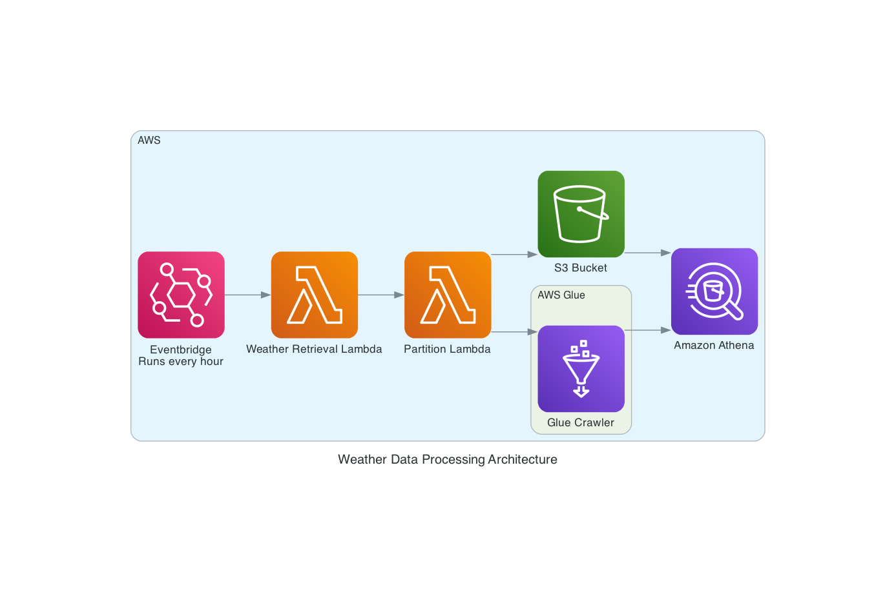

# Weather Data Processing Assignment

## Project Overview

This project is designed to process weather data using AWS Lambda functions and CloudFormation. It includes a Python-based Lambda function for data partitioning and weather retrieval, and a set of configuration files and scripts to deploy and manage these Lambda functions.


### Directory and File Descriptions

- **`Makefile`**: A Makefile for automating build and deployment tasks. Contains instructions for building, testing, and deploying the Lambda functions.

- **`README.md`**: This file. Provides an overview and documentation for the project.

- **`lambda-python/`**: Contains the Python scripts for AWS Lambda functions.
  - **`partition_lambda.py`**: Script for partitioning data and starts a glue crawler to view the data in athena.
  - **`weather_retreiever.py`**: Script for retrieving weather data.

- **`template.yaml`**: AWS CloudFormation template defining the Lambda functions, resources, and their configurations.

- **`weather_au_layer.zip`**: A zipped AWS Lambda layer containing additional dependencies required by the Lambda functions for weather_au and bs4.

- **`weather_data.json`**: Sample or input JSON file containing weather data for testing or processing.

### Template: SSM Parameter

To add new locations, update the `LocationList` parameter in the CloudFormation template. You can specify the location values in the `Value` field of the parameter. For example:

```yaml
LocationListParameter:
  Type: AWS::SSM::Parameter
  Properties:
    Name: LocationList
    Type: StringList
    Value: "3052,2000,4000"
```

## Getting Started

### Prerequisites

- **AWS CLI**: Ensure you have AWS CLI installed and configured.
- **Python**: Python 3.x should be installed on your machine.
- **Make**: Make sure `make` is available on your system.

### Setup

1. **Deploy Lambda Functions**

   Use the `Makefile` to deploy the Lambda functions and other resources:

   ```sh
   make deploy
   ```
### High level Architecture

